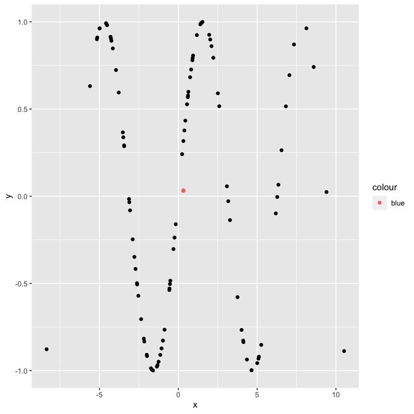

```R
library(tidyverse)
```

    ── Attaching packages ─────────────────────────────────────── tidyverse 1.3.2 ──
    ✔ ggplot2 3.4.2     ✔ purrr   1.0.1
    ✔ tibble  3.2.1     ✔ dplyr   1.1.0
    ✔ tidyr   1.3.0     ✔ stringr 1.5.0
    ✔ readr   2.1.2     ✔ forcats 0.5.2
    ── Conflicts ────────────────────────────────────────── tidyverse_conflicts() ──
    ✖ dplyr::filter() masks stats::filter()
    ✖ dplyr::lag()    masks stats::lag()


```R
x = rnorm(100, sd = 4)
y = sin(x)

df = as.data.frame(t(rbind(x,y)))
```


```R
cov(x,y)
```


-0.251900203807077


```R
plot(x,y)
```


    

    


```R
ggplot(data = df, aes(x = x, y = y)) +
    geom_point() +
    geom_point(x = mean(x), y = mean(y), aes(color = 'blue'))
```


    

    


```R
z_1 = rnorm(100)
z_2 = rnorm(100)
df = as.data.frame(t(rbind(z_1,z_2)))
cov(z_1,z_2)
ggplot(data = df, aes(x = z_1, y = z_2)) +
    geom_point()

```


0.0246421620355299


    

    

